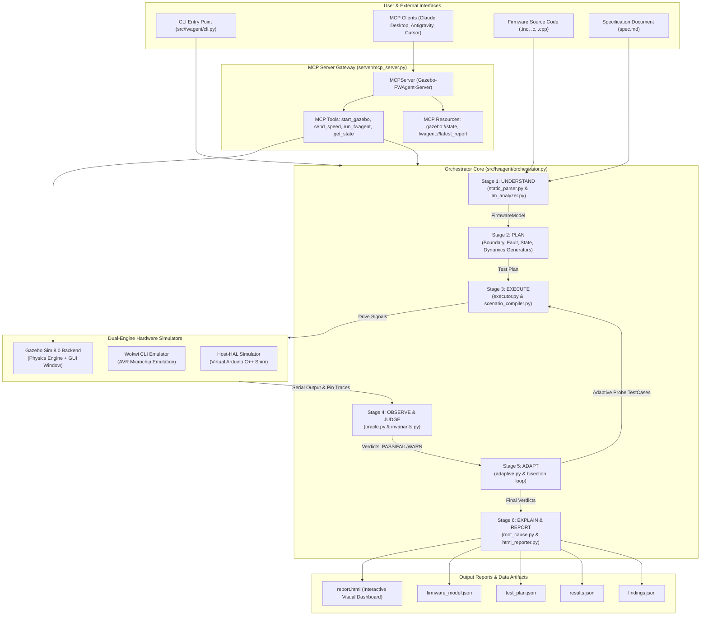
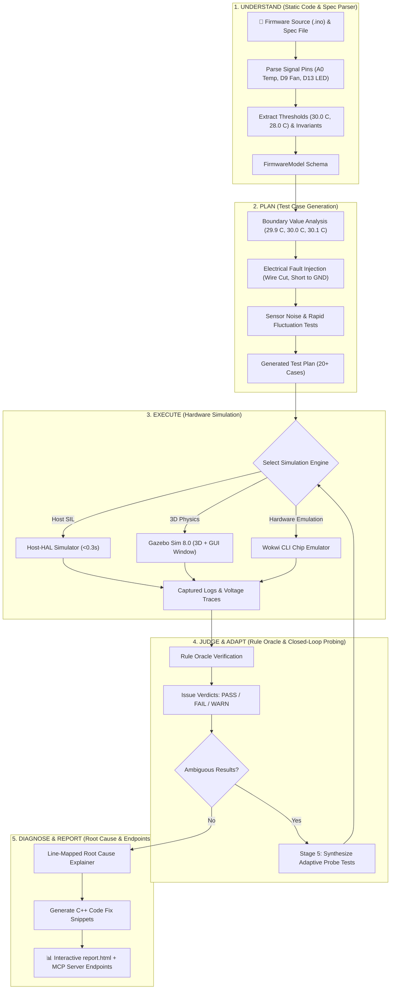

# BlackBox FW-Agent: System Architecture & Functional Flowcharts

This document provides comprehensive Mermaid flowcharts detailing the internal architecture of **BlackBox FW-Agent**, its simulation engines (Host-HAL, Wokwi CLI, Gazebo Sim), its MCP Server integration layer, and the step-by-step functional execution loop.

---

## 1. Complete Project System Architecture Flowchart

---

## 2. Functional Flowchart: What the Main Project Does

