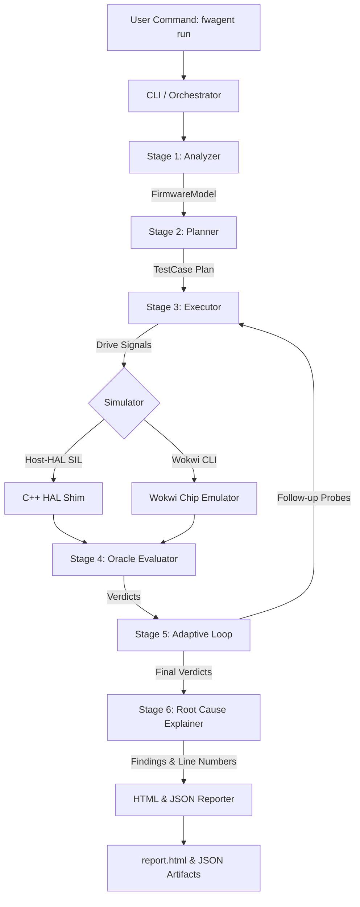

# 1. Project Overview

### What is this project?
**BlackBox FW-Agent** (`fwagent`) is an autonomous AI testing agent for embedded firmware written in C/C++ (such as Arduino/AVR microcontrollers). It reads firmware source code and optional markdown specifications, automatically generates boundary and fault test cases, runs them inside simulated hardware environments, pinpoints root-cause bugs directly to source line numbers, and builds rich HTML reports.

### What problem does it solve?
Testing embedded firmware manually is slow, error-prone, and hardware-dependent. Engineers often have to manually connect physical microcontrollers, attach logic analyzers, toggle sensor wires, and guess which lines of code caused a bug when an output behaves unexpectedly.

### Explain the problem in simple/layman language
Imagine building a smart fan that turns ON when a room gets hot. If the temperature sensor breaks or gets noisy, how do you know if the fan will turn on safely or start chattering wildly? Normally, an engineer would have to physically heat up the sensor or cut wires by hand to test it. This project automates that entire process on a computer without needing any physical hardware.

### What is our solution?
FW-Agent acts as an automated QA engineer for embedded code:
1. It reads the source code and spec files to understand what input signals (e.g. sensors), output signals (e.g. fan, LEDs), and safety rules exist.
2. It generates test cases covering normal boundaries, electrical faults (short circuits, open wires), sensor noise, and edge cases.
3. It runs the tests inside a virtual simulator (**Host-HAL** C++ simulator or **Wokwi CLI** hardware chip emulator).
4. It evaluates the results against rules and pinpoints the exact line numbers in the C++ code that caused any failure.
5. It generates an interactive HTML report complete with timelines, scorecards, line-highlighted fixes, and coverage metrics.

### Who would use it?
* Embedded systems engineers and firmware developers.
* Automated QA teams for IoT and hardware startups.
* Evaluators running automated benchmarks on embedded code.

---

# 2. How the Project Works

Here is the simple step-by-step flow executed by FW-Agent:

```text
User Command
   ↓
CLI Interface (cli.py)
   ↓
Orchestrator (orchestrator.py)
   ↓
Stage 1: UNDERSTAND (Static Code Parser & Model Builder)
   ↓
Stage 2: PLAN (Test Generator: Equivalence, Boundary, Fault, State, LLM Creative)
   ↓
Stage 3 & 4: EXECUTE, OBSERVE & JUDGE (Simulator Driver & Rule Oracle Evaluator)
   ↓
Stage 5: ADAPT (Closed-Loop Adaptive Test Generation & Bisection)
   ↓
Stage 6: EXPLAIN & REPORT (Line-Mapped Root Cause Explainer & HTML Reporter)
   ↓
Output Files (report.html, results.json, findings.json, firmware_model.json, test_plan.json)
```



---

# 3. Technology Stack

| Technology | Where/Why We Use It |
| ---------- | ------------------- |
| **Python 3.10+** | Core programming language for the agent orchestration, test generation, and reporting. |
| **Pydantic v2** | Data modeling and strict schema validation for `FirmwareModel`, `TestCase`, `Verdict`, and `Finding`. |
| **Jinja2** | HTML report rendering engine for building standalone, responsive HTML test reports. |
| **Matplotlib** | Generating signal timeline and chatter visual execution charts (`timeline_chart.png`). |
| **PyYAML** | Compiling test cases into Wokwi scenario files and reading fault/invariant configuration catalogs. |
| **Wokwi CLI** | External headless microcontroller hardware chip emulator for running compiled `.hex`/`.elf` binaries. |
| **MinGW GCC / C++** | Compiling and executing Host-HAL Software-In-the-Loop (SIL) binaries natively. |
| **Database** | *Not present.* (The project uses structured JSON file artifacts instead of a database). |
| **Frontend Framework** | *Not present.* (Reports are generated as standalone static HTML files using Jinja2 and Vanilla CSS). |

---

# 4. Folder Structure

```text
blackbox/
├── src/
│   └── fwagent/
│       ├── analyzer/       # Code parsing and model building
│       ├── evaluator/      # Rule judging and coverage calculation
│       ├── explainer/      # Line-mapped root cause analysis
│       ├── planner/        # Test case generators & adaptive loop
│       ├── reporter/       # HTML report generation and timeline charts
│       ├── simulator/      # Host-HAL and Wokwi CLI simulator drivers
│       ├── utils/          # Line indexing and execution budget trackers
│       ├── cli.py          # Command line entry point
│       ├── executor.py     # Test step executor
│       ├── models.py       # Core Pydantic data schemas
│       ├── orchestrator.py # Multi-round testing engine orchestrator
│       └── scenario_compiler.py # Wokwi scenario YAML compiler
├── firmware_samples/       # Sample Arduino firmware projects and specifications
├── hal_shim/               # C++ Hardware Abstraction Layer shim for Host-HAL
├── configs/                # Fault catalog and invariant YAML configuration files
├── tests/                  # Unit test suite
├── pyproject.toml          # Python package build file
└── README.md               # Quick project overview
```

### Explanation of Folders
* **`src/fwagent/`**: Contains the complete Python source code for the testing agent, split into modular pipeline stages.
* **`firmware_samples/`**: Holds target C++/Arduino firmware source files (`.ino`), specs (`spec.md`), and compiled binaries (`.hex`/`.elf`) for testing.
* **`hal_shim/`**: C++ header/source files providing virtual Arduino HAL functions (`pinMode`, `digitalWrite`, `analogRead`, `Serial`) for host PC execution.
* **`configs/`**: YAML files defining standard electrical fault types (open circuit, short to GND) and system invariants.
* **`tests/`**: Python unittest suite for validating the engine components.

---

# 5. Important Files

### `src/fwagent/cli.py`
**Purpose:** Entry point for running the agent from the command line interface.  
**Used by:** Users executing `python -m fwagent.cli run <firmware_dir>`.  
**In simple words:** Parses user arguments like `--sim wokwi` or `--spec spec.md` and starts the main testing engine.

### `src/fwagent/orchestrator.py`
**Purpose:** The master controller that runs the 6-stage testing loop (Understand $\rightarrow$ Plan $\rightarrow$ Execute $\rightarrow$ Observe $\rightarrow$ Judge $\rightarrow$ Adapt $\rightarrow$ Report).  
**Used by:** Called by `cli.py` to coordinate all sub-modules.  
**In simple words:** The brain of the project that runs tests in rounds, triggers adaptive probes, and collects final results.

### `src/fwagent/models.py`
**Purpose:** Defines all core data structures (`FirmwareModel`, `TestCase`, `Verdict`, `Finding`, `Signal`, `Rule`).  
**Used by:** Every module in `fwagent`.  
**In simple words:** The data dictionary of the project. Ensures every test case and result has a clean, consistent structure.

### `src/fwagent/analyzer/static_parser.py`
**Purpose:** Parses C++/Arduino `.ino` source files using regex and syntax pattern matching.  
**Used by:** Stage 1 (UNDERSTAND).  
**In simple words:** Reads the C++ code to figure out pin numbers, sensor names, threshold values (like `30.0`), and error LED declarations.

### `src/fwagent/planner/planner.py`
**Purpose:** Generates a initial set of test cases by combining boundary, equivalence, fault, dynamics, and state machine generators.  
**Used by:** Stage 2 (PLAN).  
**In simple words:** Decides what test scenarios to run (e.g. testing temperatures at 29.9 °C, 30.0 °C, 30.1 °C, and sensor wire cuts).

### `src/fwagent/scenario_compiler.py`
**Purpose:** Compiles abstract `TestCase` steps into executable simulator steps or Wokwi Scenario YAML format.  
**Used by:** `Executor` and `WokwiCLISimulator`.  
**In simple words:** Translates test instructions into actions the simulator understands (like "set pin A0 to 30.1 °C" or "wait 500ms").

### `src/fwagent/simulator/wokwi_adapter.py`
**Purpose:** Manages execution on Wokwi CLI with automatic fallback to Host-HAL SIL if Wokwi is unavailable or times out.  
**Used by:** `Orchestrator` when `--sim wokwi` is requested.  
**In simple words:** Tries to run tests on the Wokwi chip emulator first; if Wokwi fails, it seamlessly switches to the Host C++ simulator so testing never halts.

### `src/fwagent/evaluator/oracle.py`
**Purpose:** Evaluates test outputs against spec rules and invariants to issue `PASS`, `FAIL`, `WARN`, or `AMBIGUOUS` verdicts.  
**Used by:** Stage 4 (JUDGE).  
**In simple words:** The referee. Compares what actually happened during the test with what the specification required.

### `src/fwagent/explainer/root_cause.py`
**Purpose:** Maps failing test verdicts directly to exact firmware line numbers and generates suggested code fixes.  
**Used by:** Stage 6 (EXPLAIN).  
**In simple words:** Tells the user *why* a test failed, pointing to the exact line in their `.ino` file and providing a C++ code snippet to fix it.

### `src/fwagent/reporter/html_reporter.py`
**Purpose:** Renders the final interactive HTML report file with CSS styling, scorecards, coverage metrics, and timeline charts.  
**Used by:** Stage 6 (REPORT).  
**In simple words:** Takes all the verdicts, findings, and charts and packages them into a clean `report.html` page.

---

# 6. Main Features

### 1. Autonomous Specification & Code Analysis
* **What it does:** Reads C++ firmware code and optional `spec.md` files to extract pin assignments, threshold constants, and safety invariants.
* **Where it is implemented:** `src/fwagent/analyzer/static_parser.py` & `llm_analyzer.py`
* **What happens when used:** Produces a structured `firmware_model.json` without requiring any manual manual configuration.

### 2. Combinatorial & Boundary Test Generation
* **What it does:** Automatically generates boundary test cases around threshold boundaries (e.g. 29.9 °C, 30.0 °C, 30.1 °C), electrical faults, and state transitions.
* **Where it is implemented:** `src/fwagent/planner/generators/`
* **What happens when used:** Creates a clean `test_plan.json` containing test cases with explicit expectations.

### 3. Dual-Engine Simulation (Host-HAL SIL + Wokwi CLI)
* **What it does:** Executes tests either via host C++ SIL simulation (under 0.3s) or via Wokwi CLI hardware chip emulation, with automatic fallback.
* **Where it is implemented:** `src/fwagent/simulator/wokwi_adapter.py` & `host_hal.py`
* **What happens when used:** Runs tests on virtual hardware and captures UART serial streams (`T=... FAN=...`) and pin logic traces.

### 4. Closed-Loop Adaptive Testing & Bisection
* **What it does:** Analyzes failing/ambiguous test cases from Round 1 and dynamically synthesizes Round 2 adaptive probes to pinpoint exact fault limits.
* **Where it is implemented:** `src/fwagent/planner/adaptive.py` & `planner.py`
* **What happens when used:** Determines the exact trusted sensor range (e.g. `5..1018` ADC counts).

### 5. Line-Mapped Root Cause Analysis & Fix Generation
* **What it does:** Traces test failures to exact C++ source line numbers and provides drop-in C++ fix snippets.
* **Where it is implemented:** `src/fwagent/explainer/root_cause.py`
* **What happens when used:** Produces structured `Finding` objects with highlighted line numbers in the final report.

### 6. Comprehensive HTML & JSON Reporting
* **What it does:** Builds a standalone `report.html` featuring scoreboard summary cards, rule & threshold coverage %, timeline graphs, and full verdict tables.
* **Where it is implemented:** `src/fwagent/reporter/html_reporter.py` & `charts.py`
* **What happens when used:** Saves `report.html`, `results.json`, `findings.json`, `test_plan.json`, and `firmware_model.json` in the output directory.

---

# 7. Data Flow

```text
Firmware Source Code (.ino) + Specification (spec.md)
   ↓
[Stage 1: Analyzer] → Outputs: FirmwareModel
   ↓
[Stage 2: Planner] → Outputs: TestCase List
   ↓
[Stage 3: ScenarioCompiler & Executor]
   ↓
[Simulator: Host-HAL / Wokwi CLI] → Outputs: Serial Logs & Pin Traces
   ↓
[Stage 4: Oracle Evaluator] → Outputs: Verdict List (PASS / FAIL / WARN)
   ↓
[Stage 5: Adaptive Planner] → Generates Adaptive Probe TestCases (if needed)
   ↓
[Stage 6: Root Cause Explainer] → Outputs: Line-Mapped Finding List
   ↓
[Stage 6: Coverage Evaluator & Reporter]
   ↓
Final Artifacts: report.html, results.json, findings.json, firmware_model.json
```

---

# 8. Important Concepts

* **Software-In-the-Loop (SIL):** Compiling and executing C++ firmware logic natively on the host computer using virtual hardware shims (`hal_shim/`), allowing ultra-fast execution without physical chips.
* **Hardware Emulation (Wokwi CLI):** Running compiled microchip binaries (`.hex`/`.elf`) inside an emulator that simulates microchip registers, timers, and pin signals.
* **Boundary Value Analysis (BVA):** Testing inputs right at, just below, and just above threshold boundaries (e.g. testing 29.9 °C, 30.0 °C, and 30.1 °C for a 30 °C threshold).
* **Fault Injection:** Intentionally forcing abnormal electrical conditions (such as disconnecting a sensor or shorting a signal to ground) to test if the firmware handles errors safely.
* **Closed-Loop Adaptive Testing:** Using the output of initial test runs to automatically generate new, targeted follow-up test cases in subsequent rounds.
* **Rule Oracle:** An automated judge that evaluates test observations against rules defined in the specification or system invariants.
* **Line-Mapped Root Cause:** Mapping a failing test verdict directly to the specific line numbers in the C++ source code responsible for the defect.

---

# 9. How to Run the Project

Follow these exact steps to run the project locally:

### 1. Install Dependencies
Ensure you have Python 3.10+ installed, then install the package in editable mode:
```powershell
pip install -e .
```

### 2. Configure Environment Variables (Optional for Wokwi CLI)
If you want to run simulations via Wokwi CLI, set your free token from [wokwi.com/dashboard/ci](https://wokwi.com/dashboard/ci):
```powershell
$env:WOKWI_CLI_TOKEN="your_wokwi_token_here"
```
*(If no token is set, the system automatically runs on Host-HAL).*

### 3. Run Unit Tests
To verify all engine tests pass:
```powershell
python -m unittest discover tests
```

### 4. Run the Application
To run autonomous testing on a sample firmware project:

**Using Default Host-HAL Simulator:**
```powershell
python -m fwagent.cli run firmware_samples/cooling_fan_buggy --spec firmware_samples/cooling_fan_buggy/spec.md
```

**Using Wokwi CLI Simulator:**
```powershell
python -m fwagent.cli run firmware_samples/cooling_fan_buggy --spec firmware_samples/cooling_fan_buggy/spec.md --sim wokwi
```

After execution, open the generated `report.html` file in `runs/<timestamp>_<firmware>/report.html` in any web browser.

---

# 10. Quick Understanding

* **What is it?** An autonomous AI testing agent for C++/Arduino embedded firmware.
* **What problem does it solve?** Eliminates manual, slow, hardware-dependent firmware testing by automating test generation, simulation, bug pinpointing, and reporting.
* **How does it solve it?** It parses firmware code, generates boundary/fault tests, runs them in virtual simulators (Host-HAL / Wokwi CLI), evaluates rules, maps bugs to exact source line numbers, and generates HTML reports.
* **What technologies are used?** Python 3.10+, Pydantic v2, Jinja2, Matplotlib, PyYAML, Wokwi CLI, C++ (HAL Shim / MinGW GCC).
* **What are the most important files?**
  1. `src/fwagent/cli.py` (CLI entry point)
  2. `src/fwagent/orchestrator.py` (Main 6-stage execution loop)
  3. `src/fwagent/models.py` (Core data schemas)
  4. `src/fwagent/simulator/wokwi_adapter.py` (Dual-engine simulator driver)
  5. `src/fwagent/explainer/root_cause.py` (Line-mapped bug finder)
  6. `src/fwagent/reporter/html_reporter.py` (HTML report builder)
